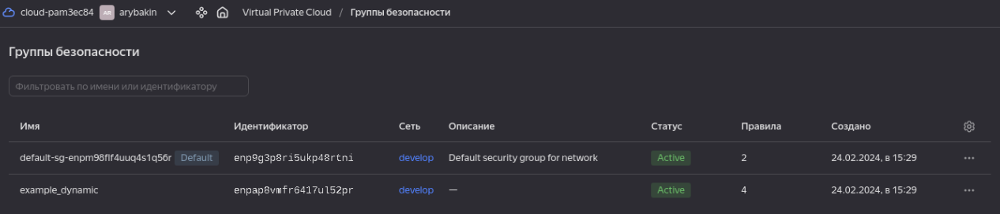
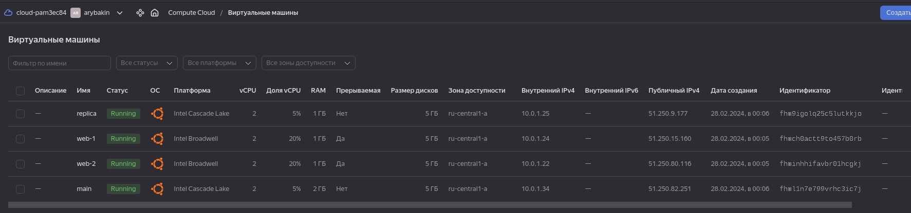
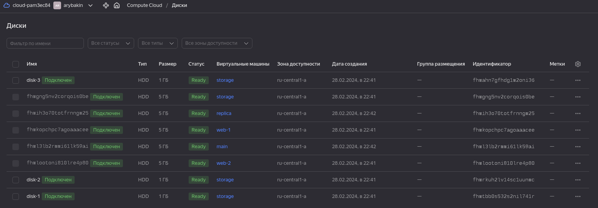

# Домашнее задание к занятию «Управляющие конструкции в коде Terraform» - Рыбакин Алексей

### Задание 1

1. Изучите проект.
2. Заполните файл personal.auto.tfvars.
3. Инициализируйте проект, выполните код. Он выполнится, даже если доступа к preview нет.

Ответ:



------

### Задание 2

1. Создайте файл count-vm.tf. Опишите в нём создание двух **одинаковых** ВМ  web-1 и web-2 (не web-0 и web-1) с минимальными параметрами, используя мета-аргумент **count loop**. Назначьте ВМ созданную в первом задании группу безопасности.(как это сделать узнайте в документации провайдера yandex/compute_instance )
2. Создайте файл for_each-vm.tf. Опишите в нём создание двух ВМ для баз данных с именами "main" и "replica" **разных** по cpu/ram/disk_volume , используя мета-аргумент **for_each loop**. Используйте для обеих ВМ одну общую переменную типа:
```
variable "each_vm" {
  type = list(object({  vm_name=string, cpu=number, ram=number, disk_volume=number }))
}
```  
При желании внесите в переменную все возможные параметры.
4. ВМ из пункта 2.1 должны создаваться после создания ВМ из пункта 2.2.
5. Используйте функцию file в local-переменной для считывания ключа ~/.ssh/id_rsa.pub и его последующего использования в блоке metadata, взятому из ДЗ 2.
6. Инициализируйте проект, выполните код.

Ответ:



<details>
<summary>count-vm.tf</summary>

```sql
data "yandex_compute_image" "ubuntu" {
  family = var.count_family
}
  resource "yandex_compute_instance" "web" {
    count = var.count_count
    name  = "web-${count.index + 1}"
    platform_id = var.platform_id
  resources {
    cores         = var.count_cores
    memory        = var.count_memory
    core_fraction = var.count_core
  }
  boot_disk {
    initialize_params {
      image_id = data.yandex_compute_image.ubuntu.image_id
    }
  }
  scheduling_policy {
    preemptible = var.preemptible
  }
  network_interface {
    subnet_id = yandex_vpc_subnet.develop.id
    nat       = var.nat
    security_group_ids = [yandex_vpc_security_group.example.id]
  }

  metadata = {
    serial-port-enable = var.meta_serial
    ssh-keys           = "ubuntu:${local.ssh_key}"
  } 
}
```
</details>

<details>
<summary>for_each-vm.tf</summary>

```sql
resource "yandex_compute_instance" "vm-for_each" {
  depends_on = [yandex_compute_instance.web]
  for_each = { for vm in var.for_each-vm : "${vm.name}" => vm }
  name = each.value ["name"]
  platform_id = var.platform_id
  resources {
        cores           = each.value ["cores"]
        memory          = each.value ["memory"]
        core_fraction   = each.value ["core_fraction"]
  }

  boot_disk {
    initialize_params {
      image_id = data.yandex_compute_image.ubuntu.image_id
    }
  }

  scheduling_policy {
    preemptible = var.preemptible
  }
  network_interface {
    subnet_id = yandex_vpc_subnet.develop.id
    nat       = var.nat
  }

  metadata = {
    serial-port-enable = var.meta_serial
    ssh-keys           = "ubuntu:${local.ssh_key}"
  } 
}
```
</details>

```sql
variable "fore_each-vm" {
  type = list(object({cores = number, name = string, memory=number, core_fraction=number},))
  default = [{name = "main", cores= 2, memory=2, core_fraction=5}, {name = "replica", cores= 2, memory= 1, core_fraction=5},]  
}
```
### Задание 3

1. Создайте 3 одинаковых виртуальных диска размером 1 Гб с помощью ресурса yandex_compute_disk и мета-аргумента count в файле **disk_vm.tf** .
2. Создайте в том же файле **одиночную**(использовать count или for_each запрещено из-за задания №4) ВМ c именем "storage"  . Используйте блок **dynamic secondary_disk{..}** и мета-аргумент for_each для подключения созданных вами дополнительных дисков.

------

Ответ:



<details>
<summary>disk_vm.tf</summary>

```sql
resource "yandex_compute_disk" "storage" {
  count   = var.disk_count
  name  = "disk-${count.index + 1}"
  size  = 1
}

resource "yandex_compute_instance" "storage" {
  name = "storage"
  resources {
    cores = var.disk_cores
    memory = var.disk_memory
    core_fraction = var.disk_core
  }

  boot_disk {
    initialize_params {
    image_id = data.yandex_compute_image.ubuntu.image_id
        }
  }

  dynamic "secondary_disk" {
   for_each =  yandex_compute_disk.storage
   content {
     disk_id = secondary_disk.value.id
   }
  }

  network_interface {
     subnet_id = yandex_vpc_subnet.develop.id
     nat     = var.nat
  }

  metadata = {
    serial-port-enable = var.meta_serial
    ssh-keys = "ubuntu:${var.vms_ssh_root_key}"
  }
}
```
</details>

### Задание 4

1. В файле ansible.tf создайте inventory-файл для ansible.
Используйте функцию tepmplatefile и файл-шаблон для создания ansible inventory-файла из лекции.
Готовый код возьмите из демонстрации к лекции [**demonstration2**](https://github.com/netology-code/ter-homeworks/tree/main/03/demo).
Передайте в него в качестве переменных группы виртуальных машин из задания 2.1, 2.2 и 3.2, т. е. 5 ВМ.
2. Инвентарь должен содержать 3 группы и быть динамическим, т. е. обработать как группу из 2-х ВМ, так и 999 ВМ.
3. Добавьте в инвентарь переменную  [**fqdn**](https://cloud.yandex.ru/docs/compute/concepts/network#hostname).
``` 
[webservers]
web-1 ansible_host=<внешний ip-адрес> fqdn=<полное доменное имя виртуальной машины>
web-2 ansible_host=<внешний ip-адрес> fqdn=<полное доменное имя виртуальной машины>

[databases]
main ansible_host=<внешний ip-адрес> fqdn=<полное доменное имя виртуальной машины>
replica ansible_host<внешний ip-адрес> fqdn=<полное доменное имя виртуальной машины>

[storage]
storage ansible_host=<внешний ip-адрес> fqdn=<полное доменное имя виртуальной машины>
```
Пример fqdn: ```web1.ru-central1.internal```(в случае указания имени ВМ); ```fhm8k1oojmm5lie8i22a.auto.internal```(в случае автоматической генерации имени ВМ зона изменяется). нужную вам переменную найдите в документации провайдера или terraform console.
4. Выполните код. Приложите скриншот получившегося файла. 

Для общего зачёта создайте в вашем GitHub-репозитории новую ветку terraform-03. Закоммитьте в эту ветку свой финальный код проекта, пришлите ссылку на коммит.   
**Удалите все созданные ресурсы**.

------
Ответ:

<details>
<summary>ansible.tf</summary>

```sql
resource "local_file" "inventory_cfg" {
  content = templatefile("${path.module}/inventory.tftpl",
    { 
    web = local.web
    db = local.db
    storage = local.storage
    }  
)
  filename = "${abspath(path.module)}/inventory.cfg"
}

resource "null_resource" "web_hosts_provision" {
depends_on = [yandex_compute_instance.storage]
  provisioner "local-exec" {
    command = "cat ~/.ssh/id_ed25519 | ssh-add -"
  }
 provisioner "local-exec" {
    command = "sleep 60"
  }
  provisioner "local-exec" {                  
    command  = "export ANSIBLE_HOST_KEY_CHECKING=False; ansible-playbook -i ${abspath(path.module)}/hosts.cfg ${abspath(path.module)}/test.yml"
    on_failure = continue
    environment = { ANSIBLE_HOST_KEY_CHECKING = "False" }
  }
    triggers = {  
      always_run         = "${timestamp()}" 
      playbook_src_hash  = file("${abspath(path.module)}/test.yml") 
      ssh_public_key = local.ssh_key
    }
}
```
</details>

<details>
<summary>inventory</summary>

```sql
[web]
web-1   ansible_host=51.250.80.225
web-2   ansible_host=158.160.123.50

[db]
main   ansible_host=158.160.108.239
replica   ansible_host=158.160.116.86

[storage]
storage   ansible_host=158.160.116.78
```
</details>